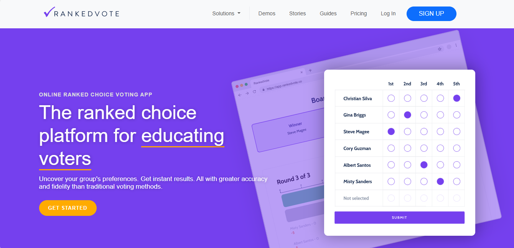
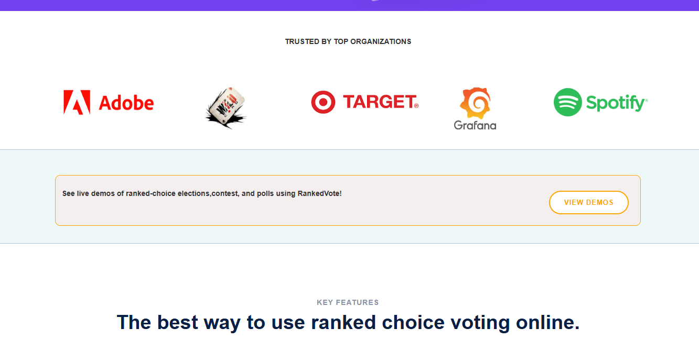
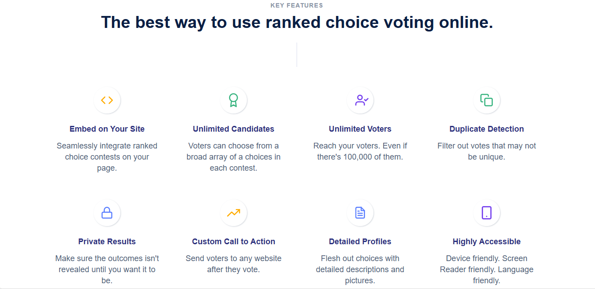
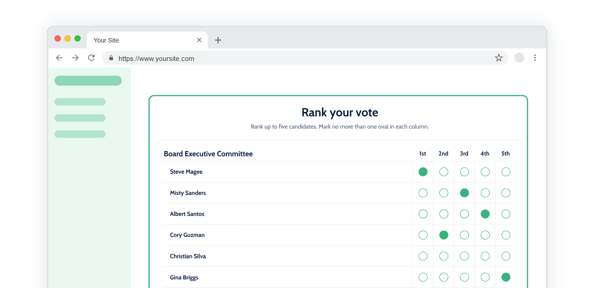
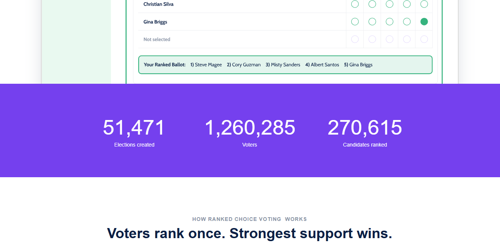
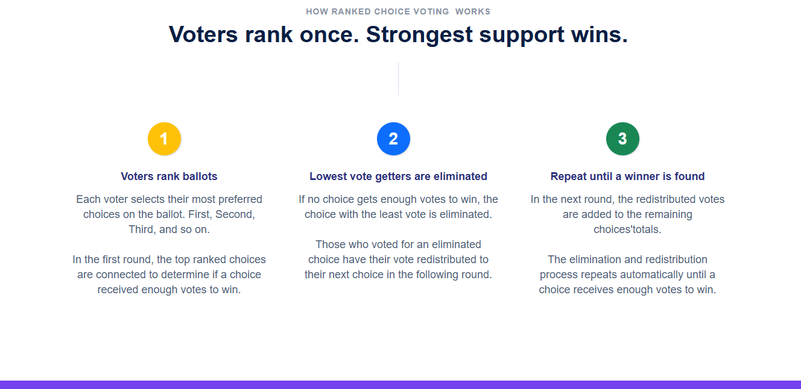
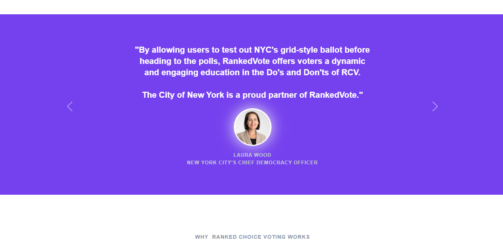
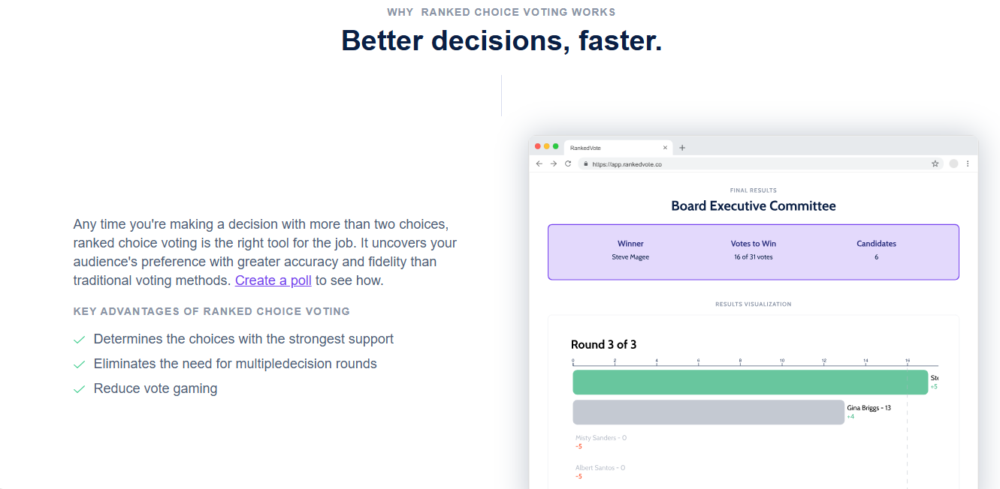
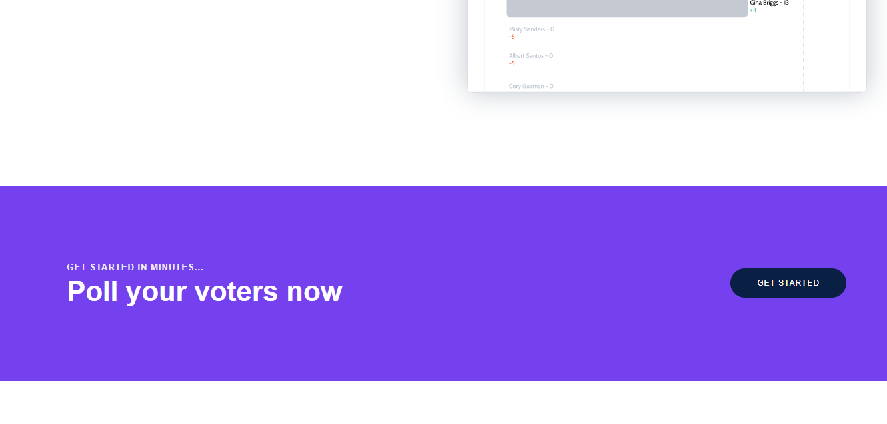
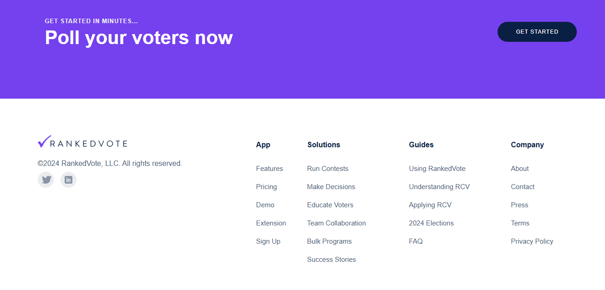

# Responsive Landing Page

A landing page built using HTML and CSS. This project was developed as part of my internship at CodeSoft.

## Key Features:
- **Use a Responsive Framework:**
  Consider using a responsive front-end framework like Bootstrap. These frameworks provide pre-built responsive components and grid systems that make it easier 
  to create a responsive design.
- **Navigation Design:**
  Create a responsive navigation menu. Use techniques like a hamburger menu for mobile devices and a full menu for larger screens.
  html
- **Mobile-First Design:**
  Start designing for the smallest screen first and then progressively enhance the design for larger screens. This approach ensures that the core content and functionality are accessible 
  on 
  mobile devices.
- **Flexible Grid Layouts:**
  Use CSS Flexbox for layout. These CSS modules allow for flexible and adaptive layouts that adjust to different screen sizes.
- **Media Queries:**
  Use CSS media queries to apply different styles based on the screen size or device characteristics. This helps in creating breakpoints for different screen sizes.
- **Accessibility:**
  Ensure that your landing page is accessible to all users, including those with disabilities. Use semantic HTML, proper ARIA roles, and ensure that your page can be navigated using a 
  keyboard.

## Screenshots

### Screenshot-01

### Screenshot-02

### Screenshot-03

### Screenshot-04

### Screenshot-05

### Screenshot-06

### Screenshot-07

### Screenshot-08

### Screenshot-09

### Screenshot-10

## Technologies Used

- **HTML**: For the structure of the landing page.
- **CSS**: For styling and layout.

